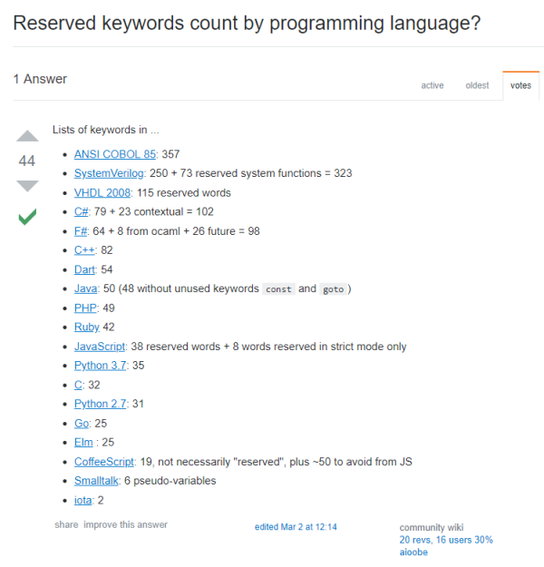

# Golang Experience


## Outline

* Grammar
* Project
* Feeling
* TODOs


## Grammar




### Loops

```go
// for all condition
for {
    fmt.Println("while true...")
}

// for keys/values in dict-like data
data := map[string]string{
    "key": "value",
}
for key, value := range data {
    fmt.Println("while true...")
}
```

### Enum

```go
// iota is enum keyword
const {
    Unknown = iota  // 0
    Male    = iota  // 1
    Female  = iota  // 2
}

// expression is as well supported
const {
    Unknown = iota * 10  // 0
    Male    = iota * 10  // 10
    Female  = iota * 10  // 20
}
```

### Error

```go
if f, err := file.Open(path); err != nil {
    return Response(400, err.Error())
}

if data, ok := json.Unmarshal(body); !ok {
    return Response(400, "invalid json body")
}
```

### Goroutine

```go
func sendTemplate() {
    // pyjy with wechat
}

func handleRequest(ctx Context) {
    validate()
    // sendTemplate()
    go sendTemplate()
}
```


## Project

* [python.org](https://www.python.org/)
* [MDN web docs](https://developer.mozilla.org/en-US/docs/Web/JavaScript)
* [golang.org](https://golang.org/)

### Environment

* [GOPATH](https://golang.org/doc/code.html)
* go fmt/go vet/go test
* package

### Production

* [modules](https://github.com/gin-gonic/gin)
* document
* configuration
* CI:build,compile,deploy
* wrk it

### Community

* [golang.org](https://golang.org/doc/effective_go.html#errors)
* [github.com](https://github.com/golang/go/wiki/CodeReviewComments)


## Feeling

### I'm vegetable

* grammar simplify
* pointers
* libraries

### I like it

* Simple
* [Gopher](https://github.com/egonelbre/gophers)
* Fast (in server side)

### Go in ZaiHui

* edge services
* performance-critical services
* multi languages/services
* multi developer teams


## TODOs

- pisces for production
- [metric, logging, tracing](https://peter.bourgon.org/go-for-industrial-programming/)
- development utilities
- services infrastructure
