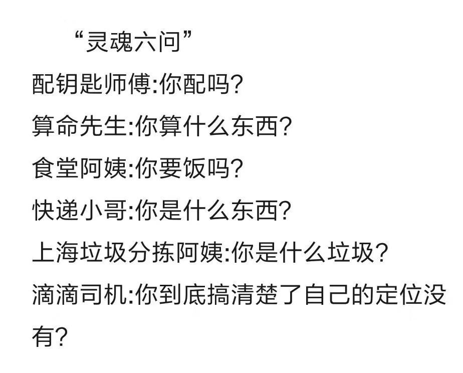
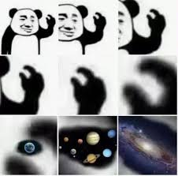
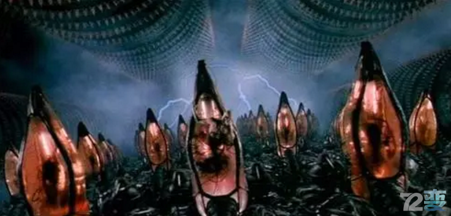
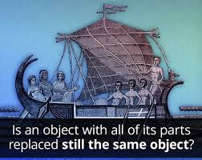
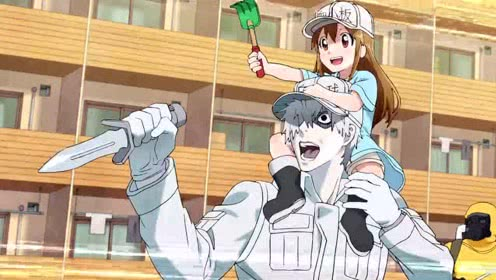
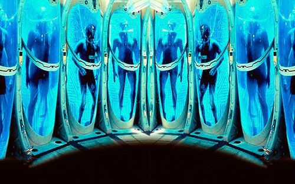
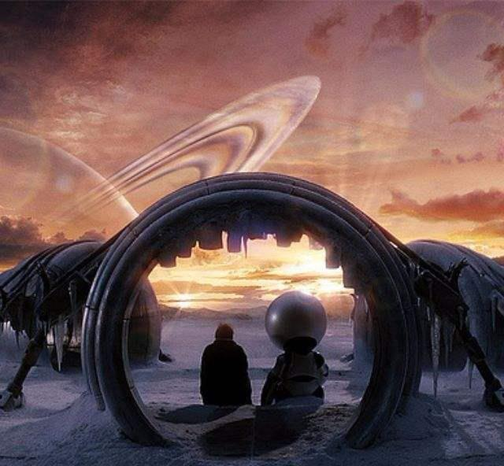
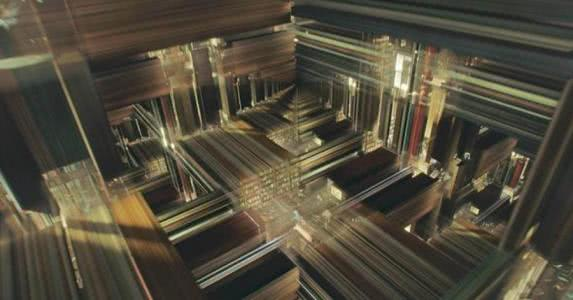

> 我是谁

## 问
> 

### 保安三问
- 你是谁？
- 你从哪来？
- 你要到哪去？

### 哲学家
- 思想是独立于现实的
- 现实是可以被推演的
- 思想实验

### 阿基里斯与龟
> 

### 缸中大脑
> 

## 忒修斯之船
> “七年之后，船所有组件都换了一遍”
> 

### “七年之后，人体的细胞都会换一遍”
> 

### “七年之后，一个公司的组织产品全变了”
> 王老吉与加多宝
> 

### 假如把换下来的零件拼成一艘新的船呢？

## 生命幻想

### 人体冷冻
> 

### 传送门
> 

### Deja Vu
> 

### 四维动物
> 

## 思考

### 连续性

- 连续性是存在的基础
- 当下是累加的产物
- 我支持加多宝

### 形态论

- 人类个体是一种普通的生命形态
- Meme, Gaia, The Crowd
- C'est TM La Vie
